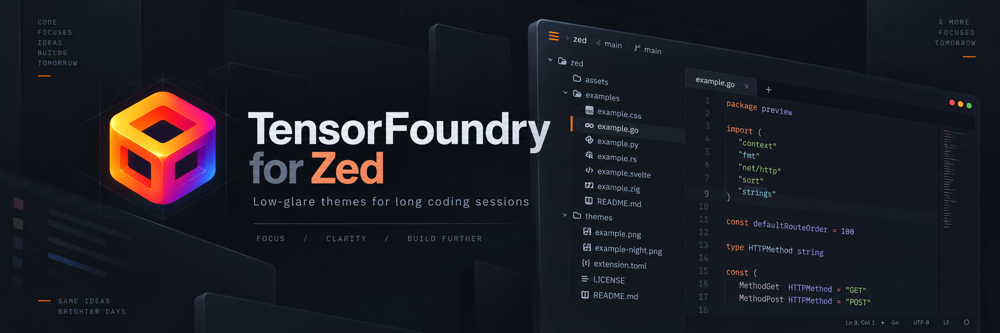
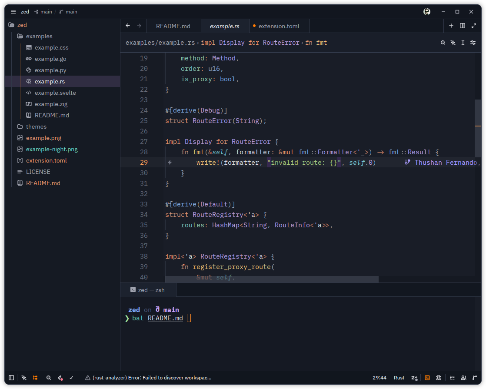
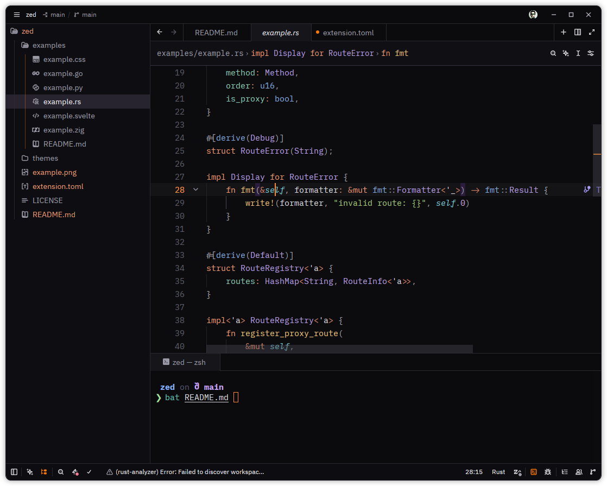
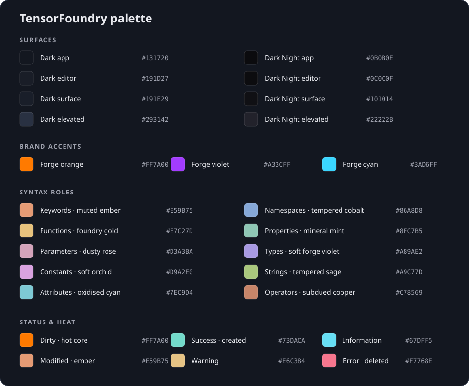

Two low-glare dark themes built for long sessions in Zed. Both use the [TensorFoundry](https://tensorfoundry.io) palette—forge orange, violet, and cyan—with softened syntax colours that keep code structure clear without visual noise.

- **TensorFoundry Dark** uses soothing graphite and midnight-slate surfaces with clear separation between editor, navigation, tabs, and panels.
- **TensorFoundry Dark Night** is the deeper near-black variant for distraction-free work.

## TensorFoundry themes in action

*A focused workspace with distinct navigation and editor surfaces, semantically grouped syntax colours, a clearly highlighted active file, and an integrated terminal that belongs to the same visual system. Click the preview for the full-size image.*

### TensorFoundry Dark

[](example.png)

### TensorFoundry Dark Night

[](example-night.png)

## Install via Zed

TensorFoundry is published in Zed's extension registry as `tensorfoundry-theme`.

1. Open the Extensions view with `zed: extensions` from the command palette (`ctrl-shift-x` on Linux and Windows, `cmd-shift-x` on macOS).
2. Search for **TensorFoundry** and select **Install**.
3. Run `theme selector: toggle` and choose **TensorFoundry Dark** or **TensorFoundry Dark Night**.

## Install as a development extension

Use this to try unreleased changes or work on the theme itself. Uninstall the registry version first so the two don't conflict.

1. Clone this repository.
2. Open Zed's command palette and run `zed: install dev extension`.
3. Select the cloned directory.
4. Run `theme selector: toggle` and choose **TensorFoundry Dark** or **TensorFoundry Dark Night**.

To use only the theme files, copy `themes/tensorfoundry-dark.json` and `themes/tensorfoundry-dark-night.json` into `~/.config/zed/themes/`, then select either variant from Zed's theme selector.

## Syntax gallery

The [`examples`](examples/) directory contains representative Go, Rust, Python, CSS, Svelte, and Zig files for reviewing the theme across different grammars and semantic constructs.

## Palette

[](assets/palette.svg)

### Surfaces

| Role | Dark | Dark Night |
| --- | --- | --- |
| App background | `#131720` | `#0B0B0E` |
| Editor | `#191D27` | `#0C0C0F` |
| Surface | `#191E29` | `#101014` |
| Elevated menus and dialogs | `#293142` | `#22222B` |
| Editor text | `#DADCE3` | `#D8D7DE` |
| Muted text | `#A0A3AF` | `#9A99A6` |

The brand accents are forge orange `#FF7A00`, forge violet `#A33CFF`, and forge cyan `#3AD6FF`.

### Syntax roles

| Role | Colour |
| --- | --- |
| Keywords and directives | `#E59B75` muted ember |
| Functions and methods | `#E7C27D` foundry gold |
| Parameters | `#D3A3BA` dusty rose |
| Constants and numbers | `#D9A2E0` soft orchid |
| Attributes and decorators | `#7EC9D4` oxidised cyan |
| Namespaces and modules | `#86A8D8` tempered cobalt |
| Properties and members | `#8FC7B5` mineral mint |
| Types and constructors | `#A89AE2` soft forge violet |
| Strings | `#A9C77D` tempered sage |
| Operators | `#C78569` subdued copper |

### Status and heat

| Role | Colour |
| --- | --- |
| Unsaved buffer | `#FF7A00` hot core |
| Modified file | `#E59B75` ember |
| Information | `#67DFF5` |
| Success and created | `#73DACA` |
| Warning | `#E6C384` |
| Error and deleted | `#F7768E` |

The palette groups code by meaning: warm tones describe control and action, violet describes structure, rose marks inputs, cool mineral tones identify metadata and member data, and green is reserved for literal content. Saturated TensorFoundry orange is reserved for focus and unsaved-work signals—the "hot tensorcube" at the centre of the interface.

## Rich semantic highlighting

For language-aware distinctions such as imported Go packages in `fmt.Errorf`, enable combined semantic tokens in Zed's `settings.json`:

```json
{
  "languages": {
    "Go": {
      "semantic_tokens": "combined"
    }
  }
}
```

Zed will keep Tree-sitter highlighting as its base and overlay information from gopls. Imported package names then use the theme's tempered-cobalt namespace colour. Run `editor: restart language server` after changing this setting if an open Go buffer does not update immediately.

## License

MIT
